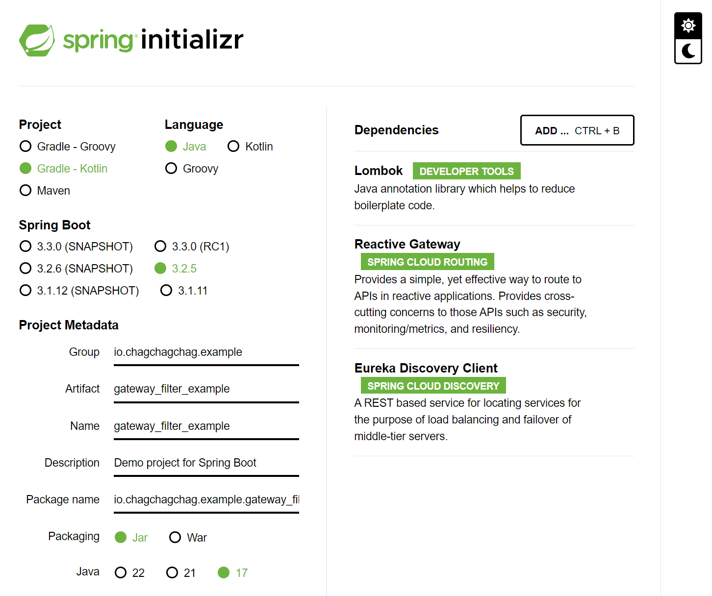
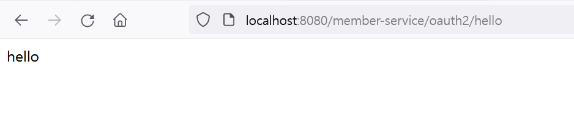
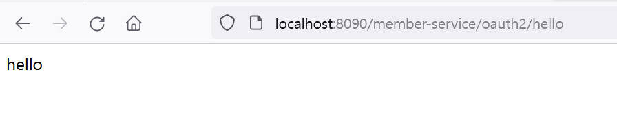

## 프로젝트 세팅

- Lombok
- Reactive Gateway
- Eureka Discovery Client 

이번 예제에서는 Servlet 기반의 Gateway 대신 Reactive Gateway 를 선택했습니다. Servlet 기반의 Gateway 예제는 추후 시간이 된다면 추가하도록 하겠습니다. 



<br/>


### gateway-service

### member-service

<br/>


## 첫번째 버전 : Non - Discovery Server 버전 (1)

Discovery Server 를 통하지 않고 Gateway 와 Gateway Client 가 1:1 로 매핑되는 상황입니다. `member-service` 라는 서비스와 `gateway-service` 가 있는 상황이라고 가정하겠습니다.<br/>


### 코드

- [Github](https://github.com/chagchagchag/example-gateway-filter-v1)
- 변경사항 내용 : [Github](https://github.com/chagchagchag/example-gateway-filter-v1/commit/71f6a47340fb16dc5eb44aa7d639e1513e46bd37)

<br/>


### gateway-service

gateway-service 의 application.yml 은 아래와 같이 구성합니다.

```yaml
spring:
  application:
    name: gateway-service
  config:
    import: # (1)
      - classpath:eureka-client-disabled.yml
      - classpath:springdoc-enabled.yml
  cloud:
    gateway:
      routes: # (2)
        - id: member-service
          uri: http://localhost:8090
          predicates:
            - Path=/member-service/**
server:
  port: 8080
```


- `(1)` : eureka-client-disabled.yml, springdoc-enabled.yml 에 명시된 내용들은 이번 예제와 크게 상관이 없기에 설명을 생략합니다. 자세한 내용은 [Github](https://github.com/chagchagchag/example-gateway-filter-v1) 을 참고해주세요.
- `(2)` : spring.cloud.gateway.routes 내에 원하는 라우트 들을 입력해줍니다.
  - member-service 라는 서비스는 uri 가 `http://localhost:8090` 이며, predicates 로는 `Path=/member-service/**` 을 지정한 상태입니다. predicates 에는 여러개의 경로를 매칭시킬 수 있으며, 현재는 `/member-service/**` 으로 member-service 내의 모든 경로에 매핑되도록 해두었습니다.
  - /member-service 는 spring.application.name 은 아니고 Gateway 입장에서 읽어들이는 /member-service 라는 접두사 입니다.
  - 나중에 정리하겠지만, 앞에 /member-service 없이도 인식이 되도록 필터를 작성하는 방법을 설명합니다.

<br/>


### member-service

#### MemberOAuth2Controller

우선은 불편하겠지만, 이번 버전에서는 첫번째 버전을 보여주기 위해 아래와 같이 `/member-service/oauth2` 경로를 매핑해주었습니다. 이후에 설명하는 버전에서 URI 앞에 붙은 `/member-service` 라는 접두사를 제거하는 방식의 예제를 설명하겠습니다.

```java
package io.chagchagchag.example.gateway_filter_example.member.application.rest;

import org.springframework.web.bind.annotation.GetMapping;
import org.springframework.web.bind.annotation.RequestMapping;
import org.springframework.web.bind.annotation.RestController;

@RestController
@RequestMapping("/member-service/oauth2")
public class MemberOAuth2Controller {
  @GetMapping("/hello")
  public String hello(){
    return "hello";
  }
}
```

<br/>


#### application.yml

별내용은 없습니다. member-service 서버의 포트를 8090 으로 해주었습니다.

```yaml
spring:
  application:
    name: member-service
  config:
    import:
      - classpath:eureka-client-disabled.yml
      - classpath:springdoc-enabled.yml
data:
  springdoc-name: member-service
server:
  port: 8090
```

<br/>


### 테스트

이번 테스트에서는 브라우저에서 테스트하는 원시적인 방법으로 테스트합니다.

#### gateway-service

gateway-service 의 포트번호인 8080 포트의 /member-service/** 으로 GET 요청을 합니다. 



<br/>


#### member-service



<br/>


### 요약

gateway-service 측에서 정해둔 규칙인 `/member-service/**` 경로에 대해 내부 서비스인 member-service 에서도 이 경로 규칙에 맞게끔 /member-service/** 에 해당하는 API 를 추가해두었습니다. 그 코드는 아래와 같았습니다.

```java
package io.chagchagchag.example.gateway_filter_example.member.application.rest;

import org.springframework.web.bind.annotation.GetMapping;
import org.springframework.web.bind.annotation.RequestMapping;
import org.springframework.web.bind.annotation.RestController;

@RestController
@RequestMapping("/member-service/oauth2")
public class MemberOAuth2Controller {
  @GetMapping("/hello")
  public String hello(){
    return "hello";
  }
}
```

<br/>

그리고 아직은 Discovery Server, Discovery Client 를 연동해두지 않은 상태이기에 localhost 로 접속하게끔 해두었습니다.<br/>

두번째 버전 예제에서는 뒤에 member-service 측에서 자꾸 gateway-service 에서 정해둔 `/member-service/**` 경로 패턴을 입력해줘야 하는 불편함과 강제성을 어떻게 해결할 수 있는지 정리하겠습니다. gateway-service 내에서 간단하게 Path 를 Rewrite 해주면 됩니다.<br/>

그리고 세번째 버전에서는 Discovery Servier, Discovery Client 를 연동합니다. <br/>

<br/>


