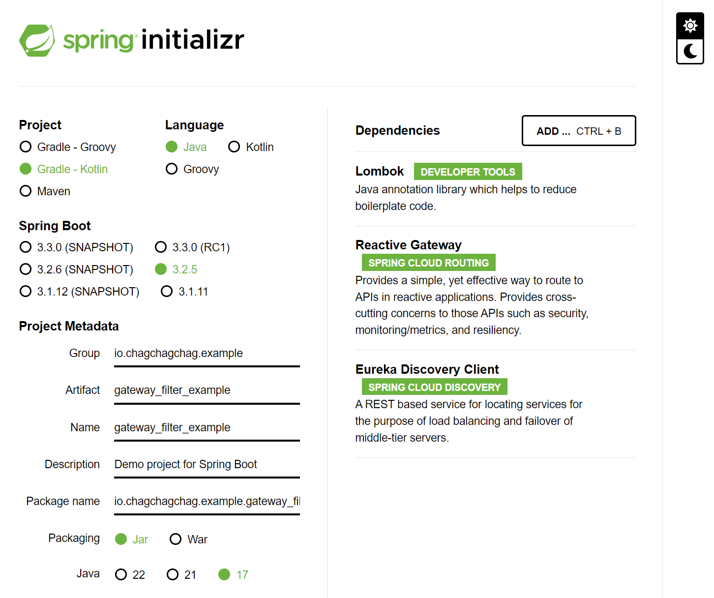
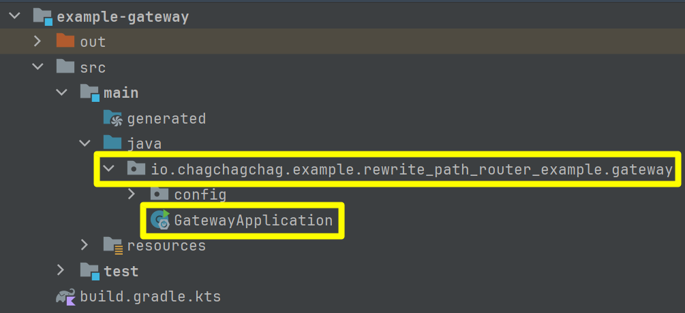
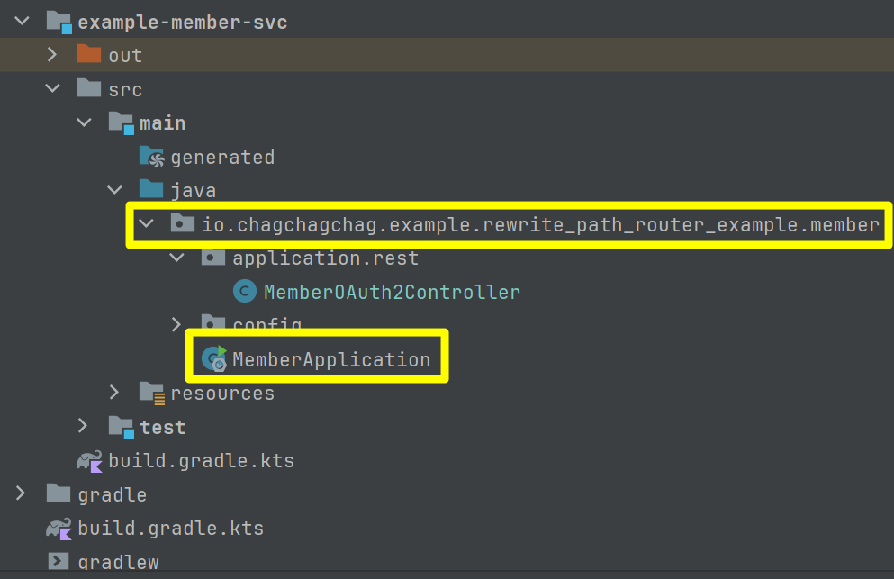
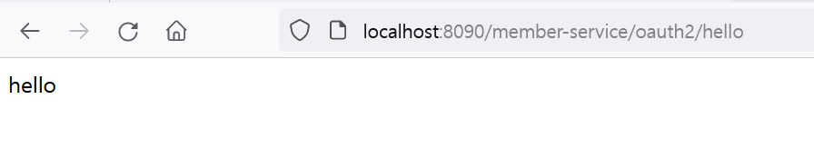
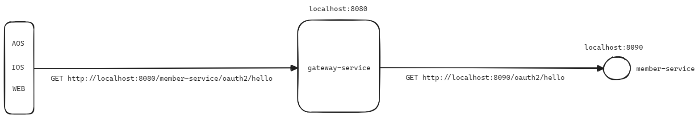
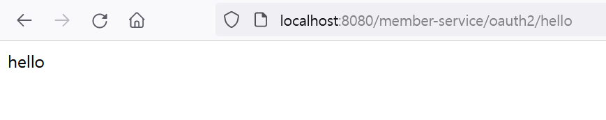
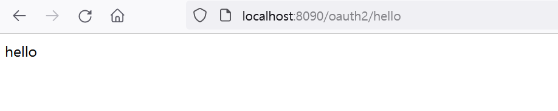

## 프로젝트 세팅

- Lombok
- Reactive Gateway
- Eureka Discovery Client 

이번 예제에서는 Servlet 기반의 Gateway 대신 Reactive Gateway 를 선택했습니다. Servlet 기반의 Gateway 예제는 추후 시간이 된다면 추가하도록 하겠습니다. 



<br/>

### 멀티모듈로 구성

멀티모듈을 구성하는 법을 모르실 분들을 위해 멀티모듈을 구성하는 방법을 간단하게 작성해보면 아래와 같이 작성하시면 됩니다. 

- 먼저 `gateway-service` 라는 이름의 디렉터리를 생성합니다.
- 방금 생성한 `gateway-service` 디렉터리 내에 `build.gradle.kts` 파일을 생성합니다.
- 이번에는 `member-service` 라는 이름의 디렉터리를 생성합니다.
- 방금 생성한 `member-service` 디렉터리 내에 `build.gradle.kts` 파일을 생성합니다.
- 프로젝트 루트의 settings.gradle.kts 에 `gateway-service`, `member-service` 를 include 하는 구문을 작성합니다. settings.gradle.kts 파일의 내용은 아래의 코드를 참고해주세요.

<br/>


settings.gradle.kts

```kotlin
rootProject.name = "rewrite_path_router_example"
include("gateway-service")
include("member-service")
```

<br/>


그리고 Gradle 탭에서 Reload All Gradle Project 버튼을 클릭하시면 모듈로 인식되었다는 표시로 디렉터리에 파란불이 들어오는데, 이렇게 표시되었다는 것은 모듈로 인식되었다는 의미입니다.<br/>

<br/>


### gateway-service

#### build.gradle.kts

build.gradle.kts 에는 아래의 내용을 입력합니다.

```kotlin
plugins {
  java
  id("org.springframework.boot") version "3.2.5"
  id("io.spring.dependency-management") version "1.1.4"
}

group = "io.chagchagchag.example"
version = "0.0.1-SNAPSHOT"

java {
  sourceCompatibility = JavaVersion.VERSION_17
}

configurations {
  compileOnly {
    extendsFrom(configurations.annotationProcessor.get())
  }
}

repositories {
  mavenCentral()
}

extra["springCloudVersion"] = "2023.0.1"

dependencies {
  implementation("org.springframework.cloud:spring-cloud-starter-gateway")
  implementation("org.springdoc:springdoc-openapi-starter-webmvc-ui:2.5.0")
  compileOnly("org.projectlombok:lombok")
  annotationProcessor("org.projectlombok:lombok")
  testImplementation("org.springframework.boot:spring-boot-starter-test")
  testImplementation("io.projectreactor:reactor-test")
}

dependencyManagement {
  imports {
    mavenBom("org.springframework.cloud:spring-cloud-dependencies:${property("springCloudVersion")}")
  }
}

tasks.withType<Test> {
  useJUnitPlatform()
}
```

<br/>


#### 프로젝트 구성

패키지를 build.gradle.kts에서 명시한 group 을 포함한 패키지 명으로 만들고 그 아래에 구성해주시고, GatewayApplication 클래스를 추가합니다. `rewrite_path_router_example` 은 이 문서의 두번째 버전 예제를 작성한 예제의 패키지 명입니다. 이 글을 따라서 작성하시는 분이 계시다면, 원하는 패키지 명을 직접 지정해주세요.



<br/>


GatewayApplication 의 내용은 아래와 같습니다.

```java
package io.chagchagchag.example.rewrite_path_router_example.gateway;

import org.springframework.boot.SpringApplication;
import org.springframework.boot.autoconfigure.SpringBootApplication;

@SpringBootApplication
public class GatewayApplication {

	public static void main(String[] args) {
		SpringApplication.run(GatewayApplication.class, args);
	}

}
```

<br/>


### member-service

#### build.gradle.kts

build.gradle.kts 에는 아래의 내용을 입력합니다.

```kotlin
plugins {
  java
  id("org.springframework.boot") version "3.2.5"
  id("io.spring.dependency-management") version "1.1.4"
}

group = "io.chagchagchag.example"
version = "0.0.1-SNAPSHOT"

java {
  sourceCompatibility = JavaVersion.VERSION_17
}

configurations {
  compileOnly {
    extendsFrom(configurations.annotationProcessor.get())
  }
}

repositories {
  mavenCentral()
}

extra["springCloudVersion"] = "2023.0.1"

dependencies {
  implementation("org.springframework.boot:spring-boot-starter-webflux")
  implementation("org.springframework.cloud:spring-cloud-starter-netflix-eureka-client")
  implementation("org.springdoc:springdoc-openapi-starter-webmvc-ui:2.5.0")
  compileOnly("org.projectlombok:lombok")
  annotationProcessor("org.projectlombok:lombok")
  testImplementation("org.springframework.boot:spring-boot-starter-test")
  testImplementation("io.projectreactor:reactor-test")
}

dependencyManagement {
  imports {
    mavenBom("org.springframework.cloud:spring-cloud-dependencies:${property("springCloudVersion")}")
  }
}

tasks.withType<Test> {
  useJUnitPlatform()
}
```

<br/>


#### 프로젝트 구성

패키지를 build.gradle.kts에서 명시한 group 을 포함한 패키지 명으로 만들고 그 아래에 구성해주시고, MemberApplication 클래스를 추가합니다. `rewrite_path_router_example` 은 이 문서의 두번째 버전 예제를 작성한 예제의 패키지 명입니다. 이 글을 따라서 작성하시는 분이 계시다면, 원하는 패키지 명을 직접 지정해주세요.



<br/>


MemberApplication 클래스의 내용은 아래와 같습니다.

```java
package io.chagchagchag.example.rewrite_path_router_example.member;

import org.springframework.boot.SpringApplication;
import org.springframework.boot.autoconfigure.SpringBootApplication;

@SpringBootApplication
public class MemberApplication {

  public static void main(String[] args) {
    SpringApplication.run(MemberApplication.class, args);
  }
}
```

<br/>


## 첫번째 버전 : Non-Discovery Server 버전 (1)

Discovery Server 를 통하지 않고 Gateway 와 Gateway Client 가 1:1 로 매핑되는 상황입니다. `member-service` 라는 서비스와 `gateway-service` 가 있는 상황이라고 가정하겠습니다.<br/>


<br/>


### 코드

- [github.com/chagchagchag/example-gateway-router-filter-v1](https://github.com/chagchagchag/example-gateway-router-filter-v1)
- [github.com/chagchagchag/example-gateway-router-filter-v1/1-simple-gateway-router](https://github.com/chagchagchag/example-gateway-router-filter-v1/tree/main/1-simple-gateway-router)
- 변경사항 내용 : [Github](https://github.com/chagchagchag/gateway-service-filter-v1/commit/71f6a47340fb16dc5eb44aa7d639e1513e46bd37)

<br/>


### gateway-service

gateway-service 의 application.yml 은 아래와 같이 구성합니다.

```yaml
spring:
  application:
    name: gateway-service
  config:
    import: # (1)
      - classpath:eureka-client-disabled.yml
      - classpath:springdoc-enabled.yml
  cloud:
    gateway:
      routes: # (2)
        - id: member-service
          uri: http://localhost:8090
          predicates:
            - Path=/member-service/**
server:
  port: 8080
```


- `(1)` : eureka-client-disabled.yml, springdoc-enabled.yml 에 명시된 내용들은 이번 예제와 크게 상관이 없기에 설명을 생략합니다. 자세한 내용은 [Github](https://github.com/chagchagchag/gateway-service-filter-v1) 을 참고해주세요.
- `(2)` : spring.cloud.gateway.routes 내에 원하는 라우트 들을 입력해줍니다.
  - member-service 라는 서비스는 uri 가 `http://localhost:8090` 이며, predicates 로는 `Path=/member-service/**` 을 지정한 상태입니다. predicates 에는 여러개의 경로를 매칭시킬 수 있으며, 현재는 `/member-service/**` 으로 member-service 내의 모든 경로에 매핑되도록 해두었습니다.
  - /member-service 는 spring.application.name 은 아니고 Gateway 입장에서 읽어들이는 /member-service 라는 접두사 입니다.
  - 나중에 정리하겠지만, 앞에 /member-service 없이도 인식이 되도록 필터를 작성하는 방법을 설명합니다.

<br/>


### member-service

#### MemberOAuth2Controller

우선은 불편하겠지만, 이번 버전에서는 첫번째 버전을 보여주기 위해 아래와 같이 `/member-service/oauth2` 경로를 매핑해주었습니다. 이후에 설명하는 버전에서 URI 앞에 붙은 `/member-service` 라는 접두사를 제거하는 방식의 예제를 설명하겠습니다.

```java
package io.chagchagchag.example.gateway_filter_example.member.application.rest;

import org.springframework.web.bind.annotation.GetMapping;
import org.springframework.web.bind.annotation.RequestMapping;
import org.springframework.web.bind.annotation.RestController;

@RestController
@RequestMapping("/member-service/oauth2")
public class MemberOAuth2Controller {
  @GetMapping("/hello")
  public String hello(){
    return "hello";
  }
}
```

<br/>


#### application.yml

별내용은 없습니다. member-service 서버의 포트를 8090 으로 해주었습니다.

```yaml
spring:
  application:
    name: member-service
  config:
    import:
      - classpath:eureka-client-disabled.yml
      - classpath:springdoc-enabled.yml
data:
  springdoc-name: member-service
server:
  port: 8090
```

<br/>


### 테스트

이번 테스트에서는 브라우저에서 테스트하는 원시적인 방법으로 테스트합니다.

#### gateway-service

gateway-service 의 포트번호인 8080 포트의 /member-service/** 으로 GET 요청을 합니다. 


<br/>


#### member-service



<br/>


### 요약

gateway-service 측에서 정해둔 규칙인 `/member-service/**` 경로에 대해 내부 서비스인 member-service 에서도 이 경로 규칙에 맞게끔 /member-service/** 에 해당하는 API 를 추가해두었습니다. 그 코드는 아래와 같았습니다.

```java
package io.chagchagchag.example.gateway_filter_example.member.application.rest;

import org.springframework.web.bind.annotation.GetMapping;
import org.springframework.web.bind.annotation.RequestMapping;
import org.springframework.web.bind.annotation.RestController;

@RestController
@RequestMapping("/member-service/oauth2")
public class MemberOAuth2Controller {
  @GetMapping("/hello")
  public String hello(){
    return "hello";
  }
}
```

<br/>

그리고 아직은 Discovery Server, Discovery Client 를 연동해두지 않은 상태이기에 localhost 로 접속하게끔 해두었습니다.<br/>

두번째 버전 예제에서는 뒤에 member-service 측에서 자꾸 gateway-service 의 application.yml 에서 정해둔 `/member-service/**` 경로 패턴을 입력해줘야 하는 불편함과 강제성을 어떻게 해결할 수 있는지 정리하겠습니다. gateway-service 내에서 간단하게 Path 를 Rewrite 해주면 됩니다.<br/>

그리고 세번째 버전에서는 Daiscovery Servier, Discovery Client 를 연동합니다. <br/>

<br/>


## 두번째 버전 : Non-Discovery Server 버전 (2) - Path Rewrite

첫번째 버전은 member-service 측에서 자꾸 gateway-service 의 application.yml 에서 정해둔 `/member-service/**` 경로 패턴을 입력해줘야 하는 불편함과 강제성이 있습니다. <br/>



이번 버전에서는 외부에서 gateway-service 를 거쳐서 member-service 에 request 를 보낼때 `/member-service/**` 으로 요청을 하지만, member-service 내의 API 에 접근할 때 `/member-service/**` 를 접두사를 붙이지 않아도 원하는 `/member-service/**` 로 접근이 가능하도록 하는 방법을 설명합니다.

간단하게 표현식을 application.yml 내의 filters 항목에 추가해주기만 되기에 어려운 버전의 문서는 아닙니다.<br/>

Gateway 의 Filter 에 대해서는 조만간 별도의 문서에 정리할 예정입니다. 현재는 개념 문서라기 보다는 How to 에 해당하는 예제 문서이기에 실습 과정만을 정리합니다.<br/>

<br/>


### 코드

- [github.com/chagchagchag/example-gateway-router-filter-v1](https://github.com/chagchagchag/example-gateway-router-filter-v1)
- [github.com/chagchagchag/example-gateway-router-filter-v1/2-rewrite-path-router](https://github.com/chagchagchag/example-gateway-router-filter-v1/tree/main/2-rewrite-path-router)

<br/>


### gateway-service

#### appliacation.yml

```yaml
spring:
  application:
    name: gateway-service
  config:
    import:
      - classpath:eureka-client-disabled.yml
      - classpath:springdoc-enabled.yml
  cloud:
    gateway:
      routes:
        - id: member-service
          uri: http://localhost:8090
          predicates:
            - Path=/member-service/**
          filters: # (1)
            - RewritePath=/member-service/(?<segment>.*), /$\{segment}
server:
  port: 8080
```

위의 yml 파일에서 `(1)` 로 표시한 부분을 추가해줍니다.

- `/member-service/**` 로 들어오는 클라이언트로부터의 요청을  `http://localhosT:8090` 의 `/` 으로 바꿔주고 있습니다.

<br/>


### member-service

MemberOAuth2Controller 를 아래와 같이 수정해줍니다.

```java
package io.chagchagchag.example.rewrite_path_router_example.member.application.rest;

import org.springframework.web.bind.annotation.GetMapping;
import org.springframework.web.bind.annotation.RequestMapping;
import org.springframework.web.bind.annotation.RestController;

@RestController
//@RequestMapping("/member-service/oauth2") // (1)
@RequestMapping("/oauth2") // (2)
public class MemberOAuth2Controller {
  @GetMapping("/hello")
  public String hello(){
    return "hello";
  }
}
```

- `(1)` : 주석처리해줍니다.
- `(2)` : `/member-service/**` 접두사를 제거하고 `/oauth2` 를 받도록 수정해주었습니다.

<br/>


### 테스트

실행을 해봅니다.

#### gateway-service

사용자 또는 Web/IOS/AOS 개발자 입장에서는 API의 URI 가 /member-service/oauth2/hello 라는 것만 알면 됩니다. 별도의 api 서버가 위치한 ip 주소나 도메인네임을 알고 있을 필요가 없습니다.



<br/>


#### member-service

Gateway 입장에서 member-service 를 찾을 때에는 member-service 의 실제 IP 주소와 port 를 통해 찾습니다.



<br/>


